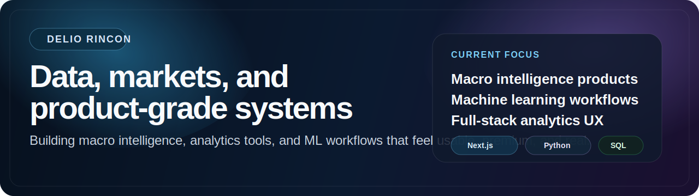

<div align="center">



# Delio Rincon


<br />


</div>

## About Me

I build systems that turn messy information into usable decisions.

My current work sits at the intersection of:

- macro and market intelligence
- full-stack analytics products
- machine learning and computer vision
- premium UX for data-heavy workflows

## What I Am Focused On

- shipping market tools that use real APIs instead of decorative mock data
- building products that explain not just what moved, but why it moved
- turning research workflows into clean, user-facing systems
- designing interfaces that feel serious, modern, and intentional

## Featured Projects

| Project | What it is |
| --- | --- |
| [`market-intel-app`](https://github.com/datawithdelio/market-intel-app) | Macro and FX intelligence platform with live market context, event analysis, and research-grade workflows. |
| [`market-intel-app-vercel`](https://github.com/datawithdelio/market-intel-app-vercel) | Deployment-focused build of Market Intel for live product delivery and iteration. |
| [`data-science-portfolio`](https://github.com/datawithdelio/data-science-portfolio) | Portfolio of analytics, modeling, and business-facing data projects. |
| [`visdrone-detr-enhanced`](https://github.com/datawithdelio/visdrone-detr-enhanced) | Computer vision work on drone-based object detection with DETR-focused experimentation. |
| [`detr-visdrone-object-detection`](https://github.com/datawithdelio/detr-visdrone-object-detection) | Object detection pipeline for VisDrone imagery with a focus on evaluation and model quality. |

## Tech Stack

```text
Frontend:   Next.js, React, TypeScript
Backend:    Node.js, Express
Data:       Postgres, SQL, vendor APIs
Analytics:  Python, notebooks, experimentation
ML/CV:      PyTorch, DETR, evaluation pipelines
Focus:      Markets, macro, product systems, research workflows
```

## GitHub Snapshot

<div align="center">
  
  
</div>

## Design Standard

The projects I care about most should feel:

- grounded in real data
- visually sharp
- explainable
- measurable
- product-grade, not just technically complete

## Connect

- GitHub: [github.com/datawithdelio](https://github.com/datawithdelio)
- LinkedIn: add your LinkedIn here
- Portfolio: add your live site here

## Notes

This profile README is backed by the special repository:

- `datawithdelio/datawithdelio`

The avatar asset for this profile lives in:

- `assets/profile/avatar-tech.svg`
