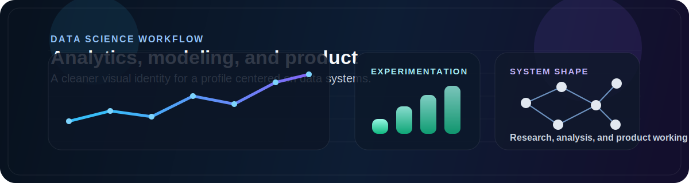

<div align="center">


<br />
<br />

# Delio Rincon


<br />


</div>

<br />

<div align="center">
  
</div>

## Overview

I build data products that feel sharp, readable, and real.

My work usually sits where these overlap:

- data science and analytics
- machine learning workflows
- product-grade dashboards
- clear UX for dense information

## What I Care About

- making data useful, not just technically correct
- building interfaces people actually want to use
- connecting modeling, analytics, and product thinking
- turning noisy inputs into structured decisions

## Featured Work

| Project | What it does |
| --- | --- |
| [`market-intel-app`](https://github.com/datawithdelio/market-intel-app) | Live macro and FX intelligence product with event context, analysis workflows, and research-style tooling. |
| [`market-intel-app-vercel`](https://github.com/datawithdelio/market-intel-app-vercel) | Product deployment branch for shipping the market platform as a cleaner live experience. |
| [`data-science-portfolio`](https://github.com/datawithdelio/data-science-portfolio) | Collection of analytics, modeling, and business-facing data science projects. |
| [`visdrone-detr-enhanced`](https://github.com/datawithdelio/visdrone-detr-enhanced) | Computer vision experimentation around DETR and drone imagery. |
| [`detr-visdrone-object-detection`](https://github.com/datawithdelio/detr-visdrone-object-detection) | Detection pipeline focused on training quality, evaluation, and deployment-minded results. |

## Stack

```text
Data Science   Python, pandas, notebooks, experimentation
Analytics      SQL, Postgres, API pipelines, dashboards
ML             PyTorch, model evaluation, workflow design
Frontend       Next.js, React, TypeScript
Backend        Node.js, Express, service integrations
Style          clean systems, clear logic, premium UI
```

## Snapshot

<div align="center">
  
  
</div>

## Design Standard

The work I ship should be:

- grounded in real data
- visually calm and modern
- explainable
- production-minded
- simple to read under pressure

## Links

- GitHub: [github.com/datawithdelio](https://github.com/datawithdelio)
- Profile repo: [`datawithdelio/datawithdelio`](https://github.com/datawithdelio/datawithdelio)

